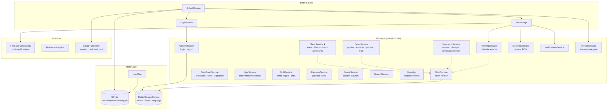
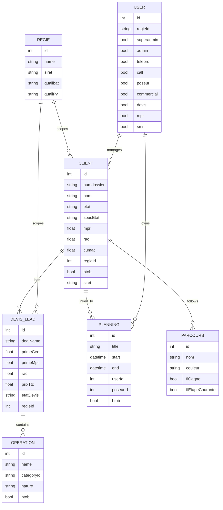
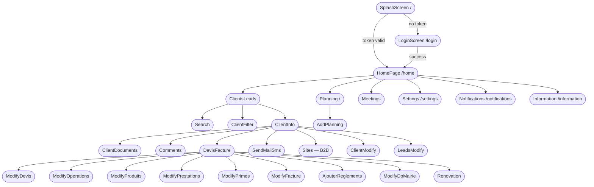
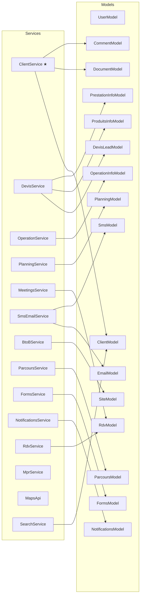
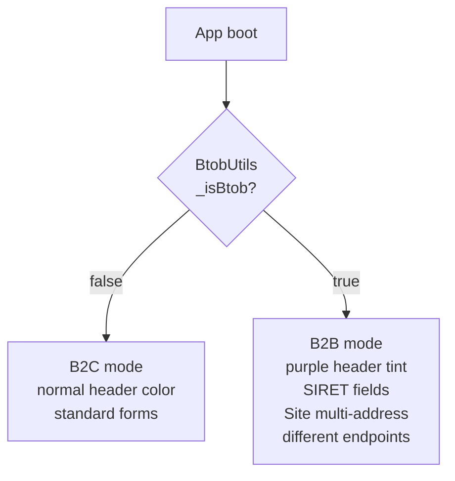
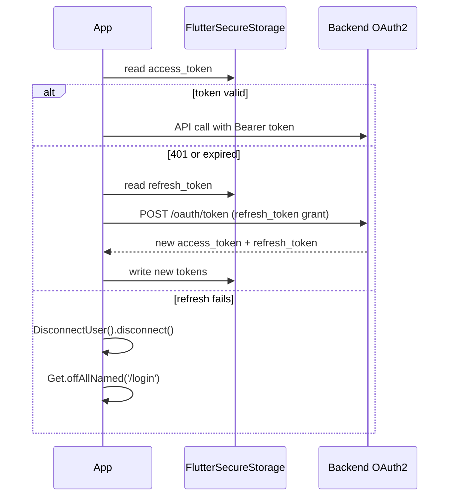

# Qhare Mobile — Architecture Graph

> Flutter CRM for energy renovation salespeople. Multi-tenant (per régie), dual B2C/B2B mode, French subsidy logic (MPR, CEE primes).
> Code: `~/freelance/qhare_mobile`

---

## High-Level Architecture

---

## Domain Model Map

---

## Screen Navigation Flow

---

## Service → Model Dependency Map

---

## Key Architectural Insights

### God Nodes (highest centrality)

| Node | Why it matters |
|------|---------------|
| `ClientService` | Used by virtually every screen — the gravitational center of the graph |
| `DevisService` | Most complex service (~1800 lines, 30+ endpoints) — entire quote-to-invoice lifecycle |
| `ClientModel` | The core entity; carries 50+ fields covering property, lead source, financials, roles |
| `DevisLeadModel` | Aggregates quote, invoice, operations, products, primes, financing, DP mairie |

### Invisible Root: Régie

Every entity (user, client, devis, operation, product, site, RDV) carries `regieId`. The régie (installation company) is the invisible multi-tenant root scoping all data. There is no superadmin cross-régie view in the app.

### B2B / B2C Bifurcation

B2B toggle persists in `FlutterSecureStorage`. All service calls append `btob`/`BtoB_mobile` params. `BtoBService.choixEntite()` syncs the toggle server-side.

### Authentication & Session Lifecycle

### Financial Subsidy Logic (MPR + CEE)

The app models the full French energy renovation subsidy ecosystem:

| Subsidy | Model field | Service |
|---------|------------|---------|
| **MaPrimeRénov (MPR)** | `ClientModel.mpr`, `DevisLeadModel.primeMpr` | `MprService` + `ClientService.check_avis` |
| **CEE primes** | `DevisLeadModel.primeCee`, `DevisLeadModel.cumac` | `OperationService.get_primes` |
| **RAC** (reste à charge) | `ClientModel.rac`, `DevisLeadModel.rac` | Computed in `DevisService.recalculer` |
| **Avis Fiscal** (DGFiP) | `AvisResponseModel` | `ClientService.check_avis` → DGFiP API |
| **Financement** (loans) | `FinancementInfo`, `FinancementModel` | `DevisService` |

### Push Notification Deep Links

Firebase push notifications can navigate directly to:
- `lead/{id}` → `ClientInfo`
- `information_qhare` → `InformationPage`

Handled in both foreground (`_firebaseMessagingBackgroundHandlerInApp`) and background tap (`_handleMessage`). Badge count managed via `flutter_new_badger`.

### Force-Update Gate

`SplashScreen` calls `VersionService` → Firebase Cloud Function `getMinimumVersion`. If the installed version is below minimum, the app shows a mandatory update dialog before routing anywhere.

---

## Communities (graphify — native code layer)

> Note: graphify only analyzed non-Dart files (iOS/Android boilerplate, Firebase functions).
> The Dart architecture above was analyzed separately.
> Source: `~/freelance/qhare_mobile/graphify-out/GRAPH_REPORT.md`

| Community | Nodes | Purpose |
|-----------|-------|---------|
| iOS App Entry Point | AppDelegate → FlutterAppDelegate | iOS native bootstrap |
| Flutter Plugin Registration | GeneratedPluginRegistrant (iOS + Android) | Auto-generated plugin wiring |
| Android App Entry Point | MainActivity | Android native bootstrap |
| Qhare Flutter App | qhare ↔ Flutter | Core framework relationship |
| iOS Bridging Header | Runner-Bridging-Header.h | Obj-C/Swift bridge |
| Firebase Cloud Functions | index.js | Version check cloud function |

---

## Files of Interest

| Path | Purpose |
|------|---------|
| `lib/main.dart` | App boot, Firebase init, UserBloc provision, GoogleTranslatorInit |
| `lib/routes.dart` | Named route map (6 top-level routes) |
| `lib/bloc/bloc/user_bloc.dart` | Single BLoC — loads user from SQLite |
| `lib/service/main_service.dart` | BaseApi + token refresh |
| `lib/service/client_service.dart` | ★ Most-used service |
| `lib/service/devis_service.dart` | Most complex service (~1800 lines) |
| `lib/utils/btob_utils.dart` | Global B2B mode toggle |
| `lib/utils/disconnect.dart` | Clears tokens + SQLite on logout |
| `lib/translator/google_translator.dart` | Wraps app in fr→es translation layer |
| `lib/database/user_database.dart` | SQLite user persistence |
| `functions/index.js` | Firebase Cloud Function — version gate |
| `.env` / `.env.production` | API base URL, OAuth2 client credentials |
| `graphify-out/graph.html` | Interactive graph (open in browser) |
| `graphify-out/GRAPH_REPORT.md` | graphify audit report |
